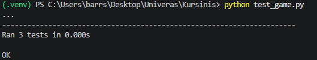

# Kursinis darbas: Hangman žaidimas

## 1. Įvadas
**Apie aplikaciją:**
Šio kursinio darbo tikslas – sukurti objektiniu požiūriu (OOP) suprojektuotą „Kartuvių“ (Hangman) žaidimą. Aplikacija leidžia vartotojui atspėti atsitiktinai parinktą žodį, valdyti žaidimo eigą bei kaupti pasiekimų statistiką. Programa suprojektuota taip, kad būtų lengvai plečiama ir modulinė.

**Kaip paleisti:**
Programą galima paleisti terminale naviguojant į projekto aplanką ir įvedus komandą:
`python main.py`

**Kaip naudotis:**
1. Paleidus programą, vartotojas prašomas įvesti savo vardą ir pasirinkti vieną iš dviejų galimų žodžių šaltinių.
2. Sistema atsitiktinai pasirenka žodį iš pasirinkto šaltinio.
3. Vartotojas bando atspėti žodžio raides. 
4. Teisingos raidės atidengiamos žodžio šablone, o neteisingos – mažina likusių gyvybių skaičių.
5. Žaidimas baigiasi, kai žodis atspėtas arba išnaudotos visos gyvybės.

---

## 2. Analizė (Body/Analysis)
Ši programa sukurta laikantis visų reikalaujamų OOP principų.

### 4 OOP ramsčiai

* **Inkapsuliacija (Encapsulation):**
Duomenų saugumas užtikrinamas paslepiant klasių vidinius atributus. Pavyzdžiui, žaidėjo taškai ir žodžio būsena nėra tiesiogiai keičiami iš išorės, o pasiekiami tik per tam skirtus metodus.

```python
# Pavyzdys iš models.py
class Player:
    def __init__(self, name):
        self.__name = name
        self.__score = 0
```

* **Abstrakcija (Abstraction):**
Naudojame ABC (Abstract Base Classes) modulį, norėdami apibrėžti bendrą žodžių šaltinio sąsają. Tai leidžia žaidimo varikliui nesirūpinti, iš kur gaunami duomenys.

```python
# Pavyzdys iš word_source.py
from abc import ABC, abstractmethod

class WordSource(ABC):
    @abstractmethod
    def get_word(self):
        pass
```

* **Paveldėjimas (Inheritance):**
Konkretūs žodžių šaltiniai (FileWordSource ir ListWordSource) paveldi bazinę klasę WordSource, perimdami jos struktūrą ir užtikrindami polimorfizmą.

```python
# Pavyzdys iš word_source.py
class FileWordSource(WordSource):
    def get_word(self):
        pass
```

* **Polimorfizmas (Polymorphism):**
HangmanEngine naudoja get_word() metodą nežinodamas, ar šaltinis yra tekstinis failas, ar sąrašas atmintyje. Tai leidžia lengvai keisti duomenų šaltinį be žaidimo logikos pakeitimų.

```python
# Pavyzdys iš engine.py
def start_new_round(self):
    self.game_word = GameWord(self.source.get_word())
```

* **Factory Method šablonas (factory.py):**
Tai leidžia centralizuotai valdyti objektų kūrimą. Užuot main.py faile tiesiogiai kūrus konkrečias klases, naudojamas fabrikas, kuris pagal nurodymą grąžina reikiamą WordSource objektą. Tai suteikia lankstumo – naujo duomenų šaltinio (pvz., duomenų bazės) integravimas pareikalautų minimalių kodo pakeitimų.

```python
# Pavyzdys iš factory.py
class WordSourceFactory:
    @staticmethod
    def get_source(type):
        if type == "file":
            return FileWordSource()
        return ListWordSource()
```

* **Kompozicija ir agregacija (Composition and aggregation):**
Kompozicija: HangmanEngine klasė viduje sukuria GameWord objektą. Šis objektas yra neatsiejama žaidimo raundo dalis.
Agregacija: HangmanEngine „turi“ Player objektą (perduotą per konstruktorių). Žaidėjas egzistuoja nepriklausomai nuo konkretaus žaidimo raundo.

```python
# Pavyzdys iš engine.py
class HangmanEngine:
    def __init__(self, player, source):
        self.player = player  
        self.source = source
        self.game_word = None
``` 
### Failų apdorojimas (File I/O)
Programa atlieka nuolatinį duomenų apsikeitimą su failais, kad būtų užtikrintas žaidimo parametrų išsaugojimas ir žodžių šaltinių nuskaitymas.

* **Duomenų skaitymas:** Žaidimas nuskaito žodžius iš tekstinių failų, taip atskirdamas duomenis nuo programos logikos. Tai leidžia vartotojui lengvai keisti žodžių sąrašus neperrašant kodo.
* **Duomenų rašymas:** Programa saugo žaidėjų pasiekimus ir statistiką į išorinius failus. Svarbu paminėti, kad realizuojant šią dalį didžiausias dėmesys buvo skiriamas duomenų vientisumui – buvo užtikrinta, kad vykdymo metu failai nebūtų sugadinti, net jei programa būtų netikėtai nutraukta.

```python
# Pavyzdys, kaip realizuotas duomenų nuskaitymas/išsaugojimas

class DataHandler:
    def __init__(self, filename="leaderboard.csv"):
        self.filename = filename

    def save_score(self, player_name, score):
        file_exists = os.path.isfile(self.filename)
        with open(self.filename, mode='a', newline='', encoding='utf-8') as file:
            writer = csv.writer(file)
            if not file_exists:
                writer.writerow(["Name", "Score"])
            writer.writerow([player_name, score])

class FileWordSource(WordSource):
    def __init__(self, filename="words.txt"):
        self.file_path = filename

    def get_word(self):
        try:
            with open(self.file_path, 'r', encoding='utf-8') as file:
                words = file.readlines()
                if not words:
                    return "FALLBACK"
                return random.choice(words).strip().upper()
        except FileNotFoundError:
            return "PYTHON"
```
## 3. Rezultatai ir santrauka

* **Testavimas:**
Programos veikimas patikrintas naudojant unittest karkasą. Automatiniai testai užtikrina žaidimo logikos stabilumą.



* **Rezultatų interpretacija:**
Programa sėkmingai vykdo žaidimo logiką, užtikrintas klaidų valdymas (pvz., neegzistuojantis failas).

* **Iššūkiai:**
Pagrindinis iššūkis buvo užtikrinti duomenų išsaugojimo logiką, kad failai nebūtų sugadinti vykdymo metu.Kitas iššūkis – suvaldyti polimorfizmą, kad Engine būtų visiškai nepriklausoma nuo duomenų šaltinio.

## 4. Išvados
Darbo metu buvo sukurta modulinė, OOP principais pagrįsta sistema. Programa lengvai plečiama ir testuojama.

Ateities perspektyvos:

1. Galima pridėti grafinę sąsają (GUI).

2. Galima integruoti išorinius žodžių šaltinius per API.

3. Galima sukurti sudėtingesnę rezultatų statistiką